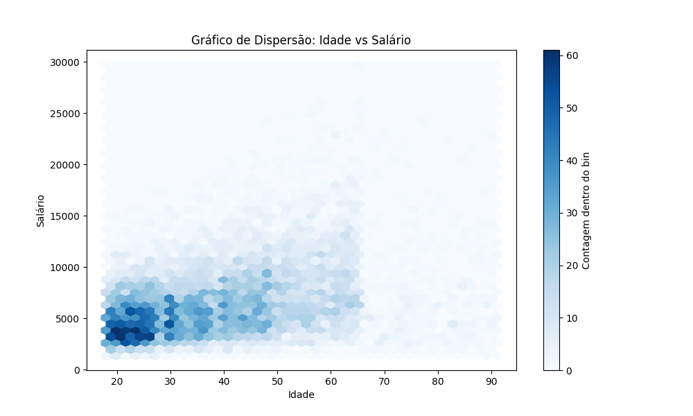

# 🧠 Projeto Inicial – Fundamentos de Ciência de Dados com Python

Este repositório reúne os exercícios e análises desenvolvidos ao longo do meu primeiro módulo de estudos em Ciência de Dados com Python. É o ponto de partida da minha transição de carreira, onde aplico conceitos essenciais de programação, análise e visualização de dados.

## 📌 Objetivos do Projeto

- Aplicar os fundamentos de Python para análise de dados.
- Compreender o funcionamento de bibliotecas como Pandas, NumPy, Matplotlib e Seaborn.
- Desenvolver raciocínio analítico com base em dados reais.
- Praticar boas práticas de organização e documentação de notebooks.

## 🛠️ Ferramentas e Bibliotecas

- Python 3.x
- Jupyter Notebook
- Pandas
- NumPy
- Matplotlib
- Seaborn

## 🔍 Conteúdo Estudado

- Manipulação de dados com Pandas (DataFrames, Series, filtros, joins)
- Operações com NumPy (arrays, funções matemáticas)
- Visualizações com Matplotlib e Seaborn (barras, linhas, scatter, heatmap)
- Análise exploratória básica
- Limpeza de dados (valores nulos, tipos, duplicatas)

## 📈 Exemplos de Visualizações

## 🚀 Próximos Passos

- Desenvolver projetos com dados reais (Kaggle, IBGE, etc.)
- Aprender SQL e integração com bases de dados
- Explorar machine learning com Scikit-Learn
- Criar dashboards interativos com Streamlit

## 🙋 Sobre Mim

Sou um desenvolvedor em transição para a área de **Ciência de Dados**, com foco em construir um portfólio sólido e aplicar soluções baseadas em dados. Este projeto marca o início dessa jornada!

- 🔗 [LinkedIn](https://www.linkedin.com/in/ijulioduarte)
- 💻 [GitHub](https://github.com/iJulioDuarte)

---
